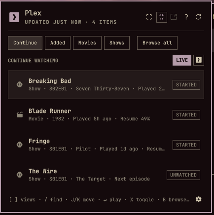
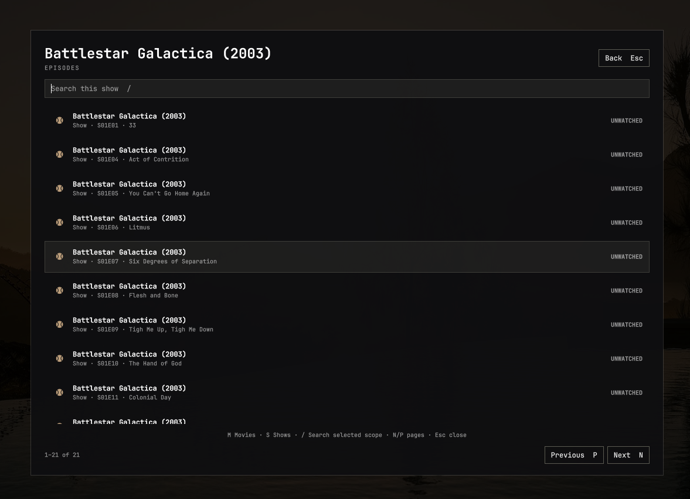
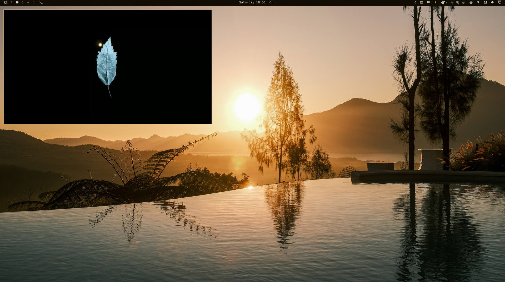

# Omaplex

Omaplex puts Plex on the Omarchy bar. The panel shows Continue Watching and Recently Added, with separate movie and show views. Browse the full library or play an item through `mpv` in a window or fullscreen. Each row shows its watched state.

## Screenshots







Show rows use the matching Plex On Deck episode when one is available. Its play action resumes the current episode or starts the next one.

Click a row to stream it through `mpv`. Choose Windowed for a normal floating, movable window or Fullscreen before playback. Windowed mode remembers its last compositor position and size for the next launch; if that rectangle is no longer visible on a connected monitor, only the saved size is used. Press `O` to open the same item in Plex Web. Press `P`, or click the Plex glyph beside the live-status badge, to open Plex Web itself.

Connection settings has an **Auto-play next episode** toggle. It is off by default. When it is on, episode playback uses Plex's continuous play queue and `mpv` starts the next episode after the current episode ends. Closing the player stops the queue. Movie playback remains single-item.

Browse All opens a separate fullscreen Omarchy panel. It searches and pages through the complete movie or show library without loading the full catalogue into the bar popup. Opening a show drills into its episodes.

`mpv` keeps its built-in on-screen controller and default keyboard bindings. Use Space for pause, the arrow keys to seek, `#` to choose an audio track, `J` to choose a subtitle track, and `F` to toggle fullscreen. Press `Ctrl+J` to search Plex's online subtitle results in an mpv menu. Typing filters that menu. The chosen result is saved for the current Plex user and added to the running player.

## Requirements

- Omarchy Quattro with the schema version 1 plugin API
- Python 3.11 or newer
- `secret-tool`, `mpv`, and `xdg-open`
- Optional: `fzf` for Browse All ranking; a bounded built-in fuzzy matcher is used when it is unavailable
- A Plex account with access to a Plex Media Server

## Install

```bash
omarchy plugin add https://github.com/pjgeutjens/omarchy-omaplex.git --enable
```

Omarchy asks for confirmation and which bar section to use.

## Local development

Copy or symlink this repository to:

```text
~/.config/omarchy/plugins/io.github.pjgeutjens.omaplex
```

Then add `io.github.pjgeutjens.omaplex` to the right section of `~/.config/omarchy/shell.json`. Saved user plugin files and `shell.json` changes reload automatically. A manual rescan is also available:

```bash
omarchy-shell shell rescanPlugins
```

## First-run setup

Open the Plex widget after installation. On first launch it opens Connection settings automatically:

1. Select **Sign in with Plex**.
2. Approve **Plex for Omarchy** in the browser window.
3. If the account has multiple servers, choose the one Omaplex should use.

The browser handles the Plex password; Omaplex never receives it. The plugin uses Plex's PIN authorization flow, discovers the account's Plex Media Servers and their advertised connections, and tests the selected server before replacing a working configuration. Open Connection settings later with `,` or the small settings button in the panel footer.

**Advanced manual connection** retains the original server-origin and token form for unusual networking, offline migration, or development. When editing a working manual connection, leave the token blank to keep the saved token.

Connection settings stores four preferences with the widget entry in `~/.config/omarchy/shell.json`. **Auto-play next episode** is disabled by default. **Subtitle search language** is a two-letter code and defaults to `en`. **Show new-item count** controls the number beside the bar icon. **Override theme colors for new items** uses the black-and-gold Plex logo instead of the Omarchy theme's active color. The two appearance preferences are enabled by default.

The server origin, client identifier, authentication mode, and discovered section IDs go to `~/.config/omaplex/config.json`; the last windowed player rectangle goes to `player-window.json` in the same private directory. Plex account and server tokens go to the desktop secret service. They are not written to Omarchy settings, cache files, URLs, logs, IPC output, or process arguments. Removing credentials from Connection settings requires a confirmation click and clears all saved authentication material and Plex data while retaining the player geometry preference.

Plain HTTP is allowed for a trusted LAN Plex server. It exposes Plex traffic to that LAN, so use HTTPS for untrusted networks.

### Optional `.env` import

For development or migration, the helper can import the four `PLEX_` values shown in `.env.example`. This is optional; the plugin does not depend on DailyDash or another project's `.env` file. The import rejects files readable by other users, so set mode `600` first.

```bash
chmod 600 /path/to/project/.env
~/.config/omarchy/plugins/io.github.pjgeutjens.omaplex/bin/omaplex \
  configure-from-env /path/to/project/.env
```

## Interaction

- Left click: open or close the panel
- Middle click: refresh
- Right click: open Connection settings
- Up/Down or J/K: move the selected row
- Enter or click: play the selected item
- X or click the watch-state badge: toggle the selected item between watched and unwatched
- [ / ]: move between Continue, Added, Movies, and Shows (H/L remain available to Omarchy for switching panels)
- /: search the rows in the current compact view
- T or the panel button: show or hide watched items
- C: Continue Watching
- A: combined Recently Added
- M: recently added movies
- S: recently added shows
- B or Browse All: open the fullscreen library browser
- ?: toggle the searchable keybindings view
- The keybindings view opens with its search field focused
- , or the footer settings button: open Connection settings
- W: select Windowed playback
- F: select Fullscreen playback
- O: open the selected item in Plex Web
- P or the Plex glyph beside the live-status badge: open Plex Web
- R: refresh the displayed Plex data
- U or Scan all: discover and scan every movie and show library
- Escape: close the panel

The panel reads `~/.cache/omaplex/recent.json` before it contacts Plex. A failed refresh keeps the last successful list and labels it offline.

Every 15 minutes, the plugin asks Plex for its current library sections and starts a scan for every numeric movie and show section it discovers. It does not assume fixed section IDs. After Plex accepts the asynchronous scan, the plugin refreshes its displayed data twice while the scan settles. `U` triggers the same process immediately; ordinary `R` remains a lightweight data refresh.

In Browse All, select Movies or Shows first, then `/` fuzzy-searches only that scope. M/S switch the unfiltered scope, N/P change pages, and Escape goes back or closes the browser. Season syntax applies to Show searches: a query such as `Alone S01` expands matching shows into naturally ordered Season 1 episode results; `S01E03` can select one episode directly.

## Playback boundary

The helper resolves the Plex media part, starts a random loopback-only HTTP endpoint, and runs `mpv` against that local URL. The helper adds `X-Plex-Token` when it requests the upstream media. This keeps the token out of `mpv` arguments while retaining Range requests for seeking.

Online subtitle search goes through the Plex server and its configured provider. Omaplex caps the result list at 40 and the downloaded subtitle at 8 MiB. The selected subtitle is written with mode `0600` inside the player's private temporary directory, loaded into mpv, and deleted when the player exits. The Plex token does not enter mpv's arguments or the subtitle file.

While mpv is open, the helper reports its playback position to Plex every ten seconds and once more when an item ends or the player closes. Plex can therefore resume later playback from the new position. Reaching 90 percent marks that item watched, including each item completed in an automatic episode queue. The panel refreshes when playback ends.

The watch-state badge is also an action. Click it, or select a row and press `X`, to send Plex a watched or unwatched update. A started item becomes watched; a watched item becomes unwatched. The panel refreshes after Plex accepts the update.

## Validation

```bash
./scripts/validate.sh
```

This runs Omarchy's plugin validator, `qmllint`, Python tests, and the Node tests for the QML data model.

## Removal

Close any player window first, then remove the widget through Omarchy Plugin Control or run:

```bash
omarchy plugin remove io.github.pjgeutjens.omaplex --yes
```

Removal does not delete saved server settings, cached lists, or secret-service entries. Prefer **Remove credentials** in Connection settings before uninstalling. For a manual reset after removal:

```bash
secret-tool clear service io.github.pjgeutjens.omaplex
secret-tool clear service io.github.pjgeutjens.omaplex kind account-token
secret-tool clear service io.github.pjgeutjens.omaplex kind pending-account-token
rm -rf ~/.config/omaplex ~/.cache/omaplex
```

Local credential removal does not revoke the authorization recorded by Plex. To revoke it too, remove **Plex for Omarchy** from Plex Web under **Settings → Authorized Devices**.

The plugin installs no service, privileged file, or Hyprland rule.
